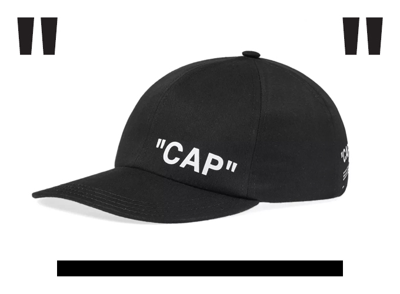
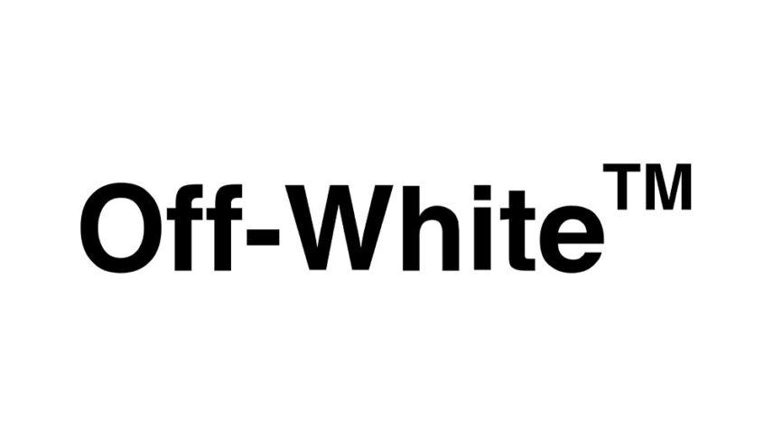
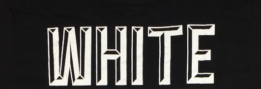
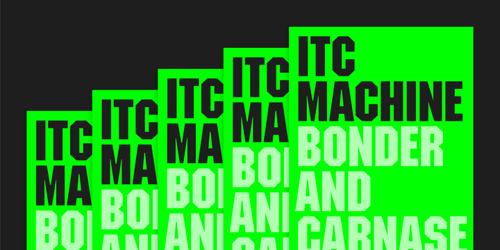

If you are unfamiliar with the brand ‘Off-white’ you may have just thought that I had forgotten to name this article, however I was actually showcasing one of ‘Off-White’s’ major branding styles!

Founded in 2013 in Milan, Off-White has become one of the most popular high-end clothing brands of today. They use a combination of simplistic typography along with bold, easily recognisable colours and designs. The brand relies heavily on a mixture of black, orange and white stripes in their clothing, often compared to with road signs.

Along with this, one of their most recognisable design elements (which I showed in my title), is the quotation marks labelling everything for what it is. For example, when searching for something on their online shop a “LOADING” sign in chunky black quotation marks is displayed.

“Off-White” keep everything in their brand straight to the point. Everything is labelled, the font is simplistic and the colours reflect driving and road signs, something monotonous that we see every day.

## Why do they do this?

Virgil Ablow, the designer of “Off-White” decided that while every other designer was trying to think of the next new and big thing, he would do the opposite and take inspiration from pre-existing things that he saw day in, day out!

## Helvetica Neue Bold

The main font used by ‘Off-White’ can be found in most places. The name of it is ‘Helvetica Neue Bold’.

A free version of this font is ‘Mytupi Bold’ and can be downloaded on hyperpix.net.

The logo is fairly low contrast, with very thick and consistent lines. One noticeable feature is that the dot above the ‘I’ is actually a square. This gives off a more street style edge as a circle would portray a more soft, rounded feel, which wouldn’t really reflect ‘Off-White’s” brand.

Although ‘Mytupi Bold’ is the more recognisable ‘Off-White’ font, they do also have another font which is used in a lot of their clothes.

## 'ITC' Machine

This font is a complete contrast to the other. The slab serifs and the bold, thick letters give off a more vintage, American feel. It adds even more to the ‘road sign’ look, with the all capital letters acting like a ‘STOP’ sign. A similar version of this font can be downloaded on ‘My Fonts.com’ and is named ‘ITC Machine.’

Virgil Ablow’s clever use of fonts and designs that we see on an everyday basis has led ‘Off-White’ to being to one of the biggest modern clothing brands, with it being crowned the most popular brand of 2019 based on shopping demands and engagement.

## Familiarity

Maybe it’s a feeling of comfort in the familiarity that draws us in? We as humans often like things to feel safe and comfortable; we are sometimes scared to go out of our comfort zone (especially with fashion), so how can you go wrong when dressing in a style that is reflected in everything you see, everywhere you go?

## **“END”**