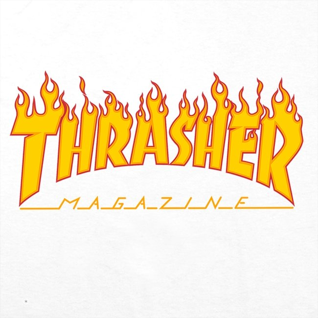
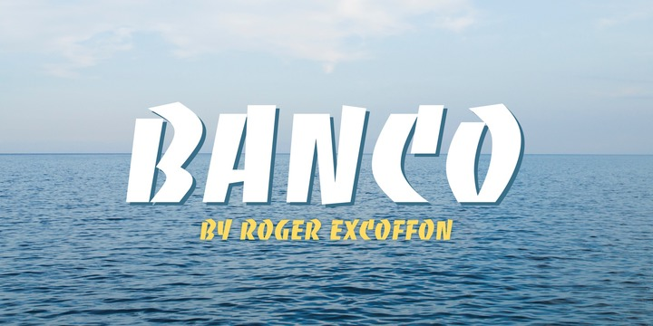

Another hugely popular brand of today is ‘Thrasher’. Thrasher was founded in January 1981 by Eric Swenson and Fausto Vitello in San Francisco, CA. The whole clothing website originated from the best-selling skateboarding magazine ‘Thrasher’ which was set up to promote a skateboarding hardware company.

## The History of 'Thrasher'

The magazines’ popularity continued to rise among skaters however, since then, it has reached a much wider audience. The style of branding appealed to much more than its intended audience and now, Thrasher has since released a series of books, ramp building manuals, videos and of course the well-known clothing brand.

It’s easy to see why Thrasher has become so popular with our generation, especially teenage boys. The logo is easily recognisable, with the word ‘Thrasher” displayed on every piece of clothing in orange and yellow capital letters, flames flickering at the top of each letter.

It encompasses the skate-boarding theme within every inch of the clothing- it’s no surprise that the company is one of the most successful clothing brands in the world right now.

## Banco

The letters are thick and bold to create the edgy, skater feel, and each letter is outlined in an orange border which is slowly being caught on fire. The word is curved, and the lines are high contrast with some letters appearing as if they are falling apart, e.g the ‘T.’ This adds to the ‘rough and ready’ branding, giving off the imperfect, rustic look.

The font can be found on ‘myfonts.com’ in the name of ‘Banco’ designed by Roger Excoffon.

## Cholla

Below the word ‘Thrasher’ there is a different use of typography. The word ‘magazine’ is spelled horizontally with lines coming off of each letter. Although this style of font is contrasting the other, the two compliment each other well and both keep that edgy feel. This font is low contrast with very thin lines. The font size is small however the all capital letters and the use of italics does not make the logo feel soft or elegant at all.

I can’t find this font however a similar one can be found on ‘myfonts.com’ named ‘Cholla.’ The lines can be edited in on photoshop.

## Authenticity

Taking inspiration from our world around us and the things that we enjoy has led to some of the best and most authentic brands and typography. ‘Thrasher’ originates from Eric Swenson and Fausto Vitello promoting their passion of skateboarding, which has in turn led them to one of the most successful brands of today.

So who knows? Maybe there’s a typographer in all of us…