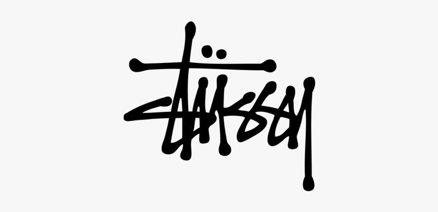

Have you ever wondered if your signature could be the face of a $50 million brand? Well, Shawn Stussy did and is now the creator of one of the biggest brands of today- Stussy.

## History

In the early 1980s, Shawn Stussy was making a living by designing handmade surfboards in California. These surfboards grew in popularity very quickly because Shawn had a very distinctive signature- a barely legible black and white grafitti-style scribble.

Over the next few years, Shawn put his signature on t-shirts and other clothing items and became one of the first ever brands to put a logo on a 'baseball cap'. 

Although Stussy originated from surfboards, Shawn Stussy really didn't like 'surfer-dudes' or the surfer culture in general. Luckily, their audience were keen for clothing which could transform from day to night/nightclubs and Shawn Stussy was eager to reciprocate.

So, by the late 80s, Stussy had adopted a more hip-hop/street style which was espeically popular in New York. 

## Logo

This logo alone has led Stussy to where it is today but why is it so special? Well, the originality for one. It goes against everything that graphic designers strive for. It's barely legible, it's messy; why would anyone want to wear a logo that you can barely read? 

But that's what's made it so successful! It fights against the rules, something that completely encompasses what life and fashion was like in the 1980s. Street style/hiphop was all about being free and not following rules so Stussy was the perfect brand to represent this!

## Analysis of Logo

The logo has very thick letters with what appears to be ink dripping. This makes the logo feel very graffiti-style; as if someone has just spray painted the letters and it's still fresh. The logo follows no rules at all; it is high contrast in some areas, has wobbly lines and some overlapping, but this is what gives the brand the imperfect, street-style look!

This is a variable-width font meaning the letters and spacings have different widths, with all of the letters being condensed and cramped together.

The logo looks quick and rushed as if someone was trying to be as quick as they could, which once again reinforces the idea of chaos, freedom and fun- all things that the 1980s are known for.

The Stussy logo was so successful that it managed to carry the brand throughout the early days of being printed on surfboards to the more street style of the 1980s, all while remaning completely intact and untouched. It is such an interchangeable logo that seems to be able to fit a wide range of styles and this is why Stussy is still and may always be one of the most popular brands for young people.