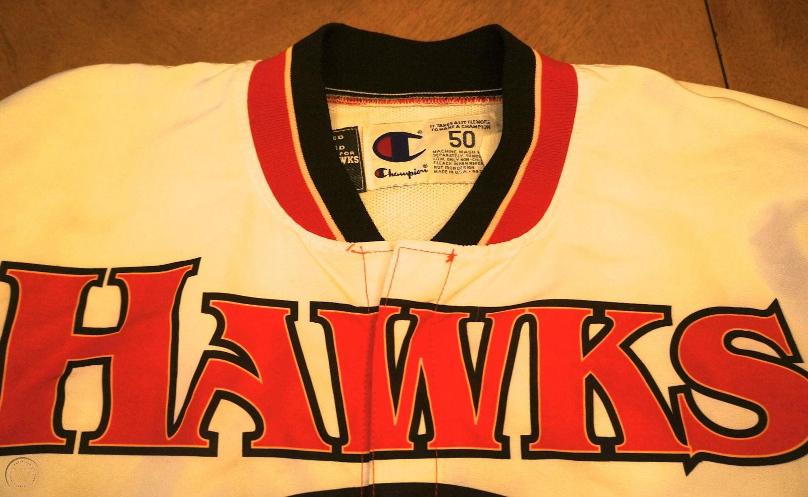
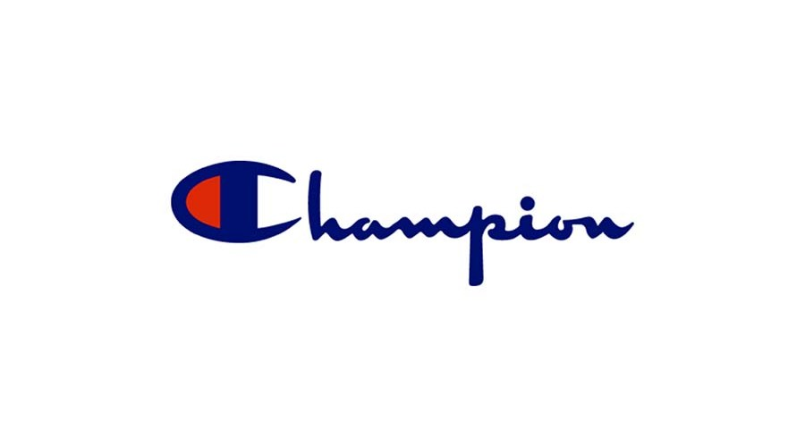

When talking about popular clothing brands with an interesting use of typography, it would be only fair to look at Champion.

Founded in 1919 in New York by Simon Feinbloom and his sons, Champion began by making clothes for young American ‘soccer’ players. The red, white and blue ‘C’ was printed across sweatshirts and baseball caps worn by mainly jocks and preps at school.

It started off as an athletic brand which was lapped up by young soccer players and cheerleaders, however it started to become popular among lots of other types of groups.

It became popular among the punk, hip-hop and skater scene too.

In more recent times, Champion has had an impressive comeback. While keeping the logo and design almost exactly how it was in 1919, Champion is as popular as ever before. With the help of collaborating with brands such as Supreme and other popular apparel, Champion is on the rise. Keeping the brand the same throughout the years has created a sense of 90s authenticity and a vintage feel.

# Knockout

Champion uses the font ‘Knockout’ for all typography. A similar font can be found on ‘dafont.com’ named ‘Monoment.’

The most recognisable part of Champion’s logo is the oversized ‘C’ which is often printed alone on lots of their clothing. The letter is thick and bold with a blue and red stripe inside the C, two colours which are often used in American ‘Soccer’ team logos. The colours are also used in the American flag, giving a sense of patriotism which is deep-rooted in America’s history- this adds to Champion’s vintage style.

The rest of the word uses a joined up monospaced typeface which gives the appearance of a student’s handwriting. The letters are thick and without serifs. The typeface has some areas of high contrast, which once again gives that hand-made feel.

# To summarise

The infamous Champion logo has led the brand to success by sticking to its roots and embracing the vintage, 90s authenticity. The logo is timeless and suits a wide range of styles due to its versatility- the bold, thick red and blue ‘C’ can be athletic, vintage, punk and on trend, all at the same time.