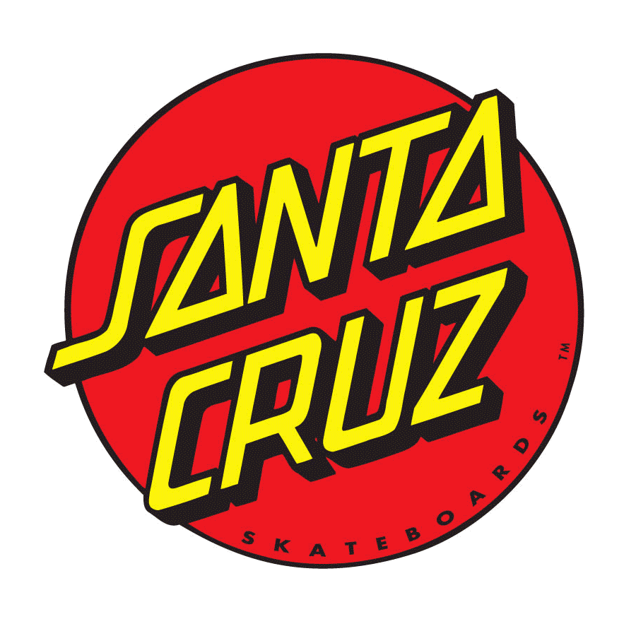
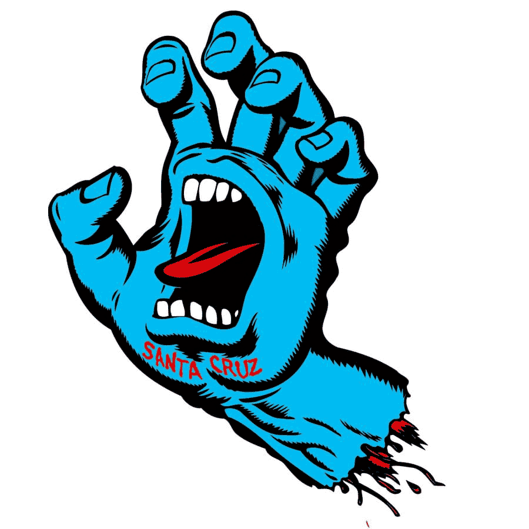

Santa Cruz is a surfing and skateboarding brand which was established in 1973 by three friends in California. It is the longest running skateboarding company in the world. 

In the early 1970s, Richard Novak, Doug Haut and Jay Shuirman ran a shop in Santa Cruz, California that supplied the materials used to create surfboards. After a negative interaction with a customer in Mccully’s Bike Shop in Hawaii, they were requested to produce 500 skateboards. They accepted the order and in 1973, Santa Cruz was born.

Competition was high in the industry, especially in California where there were countless amounts of surfing and skateboarding shops and so Santa Cruz struggled to take off. But what set Santa Cruz apart was their logo:

## The Red Dot Logo

The original logo was designed by a graphic artist and surfer named Jim Phillips who drew the typeface by hand. This logo has rocketed the success of the business, with the eye-catching graphic design style logo printed not only on skateboards, but a whole range of clothing items now too.

The Santa Cruz typeface is slanted with A’s as triangles. There is a shadow behind each letter which gives the logo that surfer/skateboarding edge to it. It is a monospaced low contrast typeface with no serifs. The S has an extended point to it which almost gives the impression of an arrow pointing left, which could represent a beach sign, pointing to the direction of the sea.  

## The Screaming Hand Logo

The second logo that Santa Cruz began to use was ‘The Screaming Hand Logo’. This soon became almost as iconic as the first one. The typeface used on this logo is thick and fuzzy, with the appearance of blotchy spray-painted graffiti. The letters are uneven and imperfect, fitting the edgy skateboarding style. 

A similar font is named 'Santa Carla' by Kirk Shelton and can be font on 'Fontmeme.com'

## In summary

Santa Cruz was so successful because the logos stood out more than any other skateboarding brand at the time. They had a completely unique logo because the typeface was hand-drawn. It was so iconic that it appealed to non-skateboarders/surfers and is now worn by thousands of young people today.