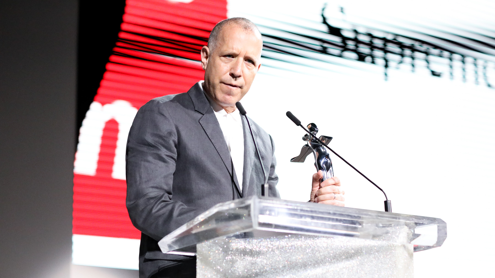
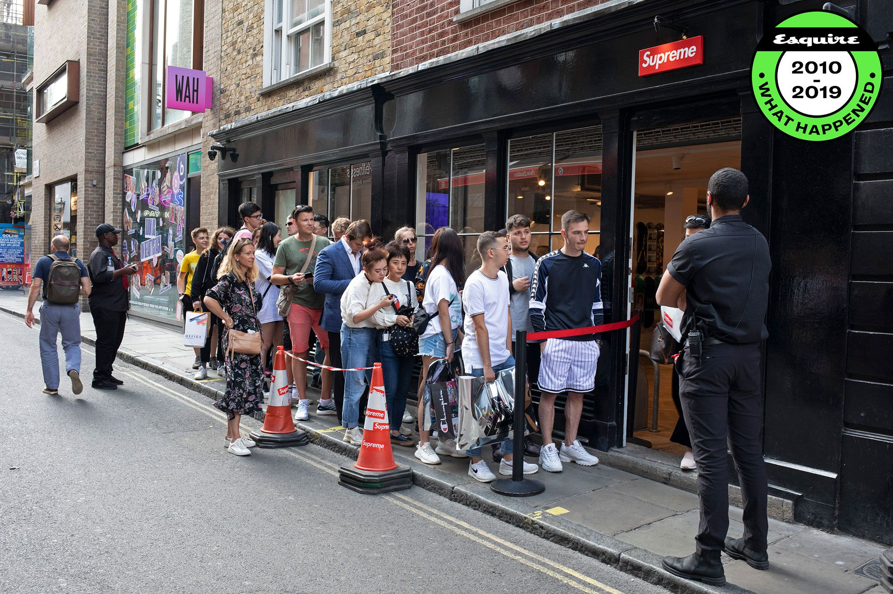

Founded in 1994 by James Jebbia, Supreme is the king of all streetwear brands. It has collaborated with all of the most popular brands and remains an inspiration to many upcoming brands. 

## History

Once again, Supreme began as a male-focused skateboarding website which then transformed into a clothing brand. James Jebbia was a clothes fanatic himself and from a young age would travel on the train to London to splash his cash on clothes that were cool and edgy. He founded a shop called Union on Spring street which was fairly successful, but the popularity of the shop soared when a man named Shawn Stussy began designing the clothes. After that, Shawn Stussy and James Jebbia worked together to run the shop and there came the birth of the iconic brands Stussy and Supreme. 

## Why is Supreme so popular?

Loyalty. Supreme has built up an extremely loyal following who will queue outside the shop for hours to get their hands on a new collection- most of which they have never seen before. They trust the brand and know that whatever is released will be cool and on-trend.

## Futura Bold Italic

The typeface used in the well-known Supreme Logo is Futura Bold Italic made by Paul Renner. The word ‘Supreme’ is in white letters with a red rectangle background. It is a sans-serif monospaced typeface with low contrast. The letters are fairly rounded and soft looking while remaining very modern. However, while this logo may seem fairly simple, when printed on clothing, the logo looks almost like a stamp and is very eye-catching. The brand mainly uses three colours; black, white and red, with the background of the logo alternating between them. Although not as bold and unique as some of the other logos I’ve mentioned, this one still stands out and it’s clear to see why the brand has become so successful.

## In Summary

James Jebba opted for a ‘less is more’ approach when it came to the design of the clothing, however, with the combination of the red background and the reliance of the three main colours, Supreme still manages to stand out, even among some of the most unique and creative logos. It is one of the most well-known clothing brands and has set the scene for a lot of other streetwear brands.