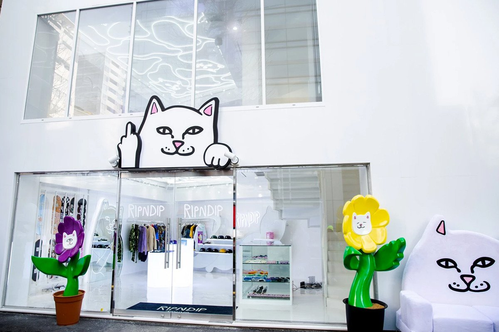
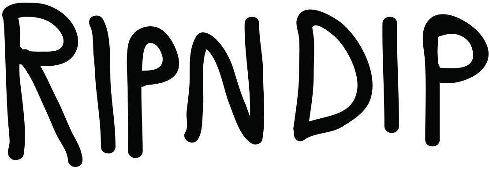
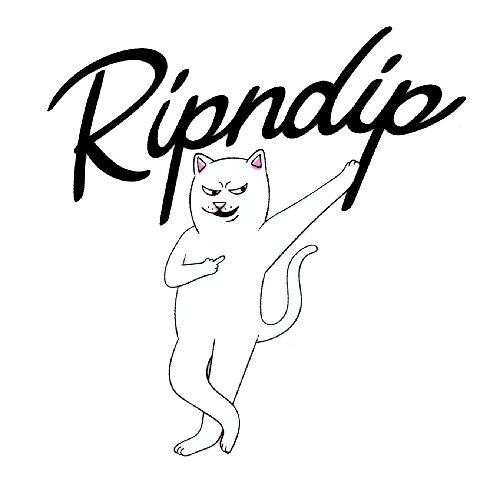

Featuring crude designs and a little cat, Rip’n’Dip has become one of the most recognisable brands of today. 

## Context

Rip’n’Dip was founded in Orlando, Florida in 2009 by Skater Ryan O’Connor while he was at a skate camp. He started off by making T-shirts for himself and a few friends until they began to catch on and everyone wanted one. He started to sell t-shirts to other people at the skate camp for $10 each until he was kicked out of the camp for taking attention away from sales of the camp’s own t-shirts. 

With a targeted audience of teenagers, Rip’n’Dip’s clothing features bold colours, crude language and cats with their middle-fingers up- a brand hard to miss. He chose prints with cats on that he said he simply found cute. 

“The brand is fun, funny and obviously not to be taken seriously.” -Ryan O’Connor

##  Typography

The main logo used by Rip’N’Dip is the one shown below:

 

The typeface is a variable-width sans serif font with thin wobbly lines. The font is fairly low contrast. Each letter is wobbly and has a different height, making the logo appear hand drawn, perhaps to represent Ryan O’Connor’s story and how he started out by drawing his logo freehand on skateboards. The letters are fairly rounded and soft, despite being in all- capitals.

I couldn’t find a similar font to the one used in this logo however it could be recreated using handwriting with a pen on photoshop. 

Another format of the logo is displayed below:

 

This type face contrasts with the first with its sharper lines and use of joined up handwriting. It almost seems like a neater version of the first. It is a fairly low contrast variable-width logo with serifs on the ‘R’ and ‘P’. 

## In Summary

Rip’N’Dip gained its success through being an authentic brand with an authentic logo. Ryan designed everything himself and once again, the ‘imperfect’ style is what drew people in.