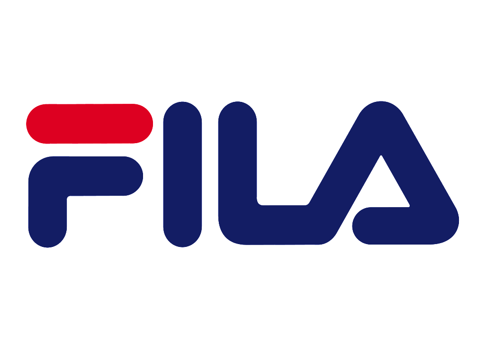

Founded by brothers Ettore and Gianservero Fila in 1911 in Biella Piedmont, Italy, Fila started out as a clothing brand with an Italian aesthetic. The boys took inspiration from everything around them to put together quality clothing. 

## Context

In 1923, Fila formed a partnership with Maglificio Biellese and the brand began to transform into a sportswear brand. There wasn’t much competition in the sportswear market at the time, so the success of the business grew rapidly. However, by the 1970s competition in the sportswear market became more intense so Fila had to make some changes. Due to the global audience and opportunity for sponsorship, Fila took on the Tennis industry. They brought something new to the traditional tennis uniform which was bright colours. Represented by the well-known tennis player Bjorn Borg, Fila began to obtain lots of celebrity endorsements which helped them to gain a wide reputation among the sports industry.

By the 90s, Fila had made its way to the hiphop scene. With chunky trainers and bold colours, it’s clear to see why the brand was still at the peak of its success. The bright colours and retro style logo suited the style of fashion that was popular at this time.

The history that Fila has and the reputation that it has gained has created a ‘retro feel’ to the clothing, which is perhaps why it is still today more popular than ever.

## Logo

The font used in the logo is very thick with rounded edges. It is a low contrast sans serif font with a triangle representing the letter ‘A’. The lines of the typeface are bold, thick and consistent. The main colours of the brand are red, blue and white and this is reflected in the logo where half of the F is red, the rest blue. The style of the font almost looks like a retro game logo with an Italian aesthetic.

The font used in the logo can be found on FFonts.net named 'Contemporary ONE Font.'

## In summary

Fila managed to capture what the sports industry was lacking in the 70s- flair and colour. They brought something new to sportswear that had never been done before and gained a reputation that carried them to their success. Now, Fila is known as a retro clothing brand appealing to not just athletic people but anyone with an eye for fashion.