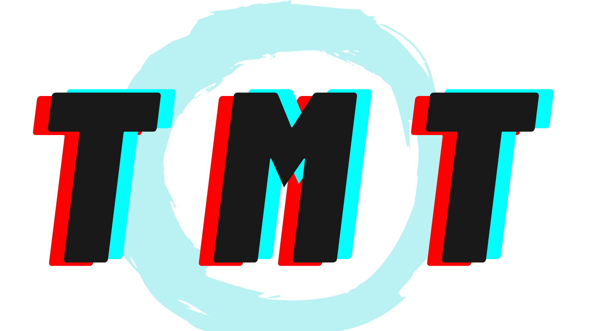
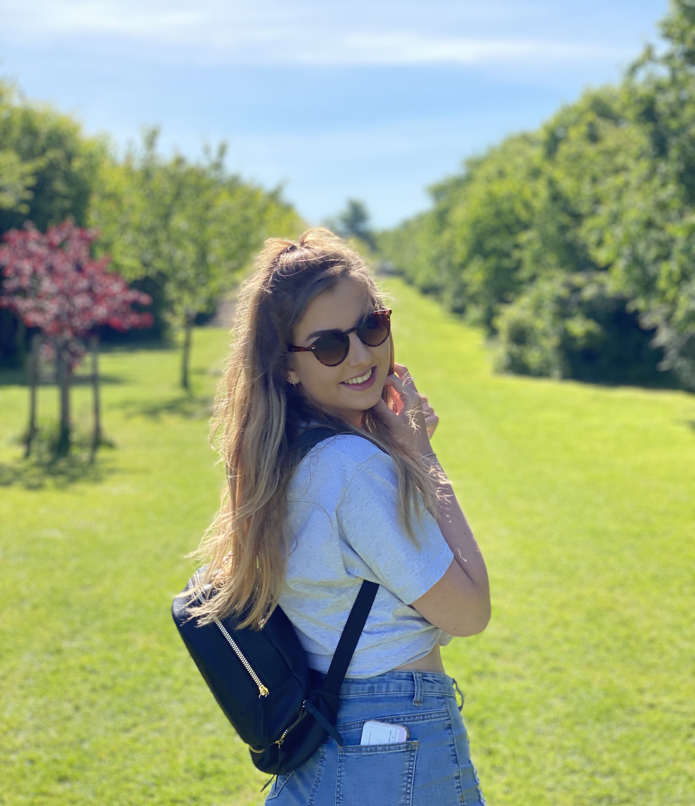

This site is all about how modern clothing brands use typography to enhance sales and connect more with their audience. 

## My website name

I decided to call my website 'Tailor-Made Typography' because 'Tailor-Made' is a term used when describing clothing and my whole site centres around clothing brands and the typography they use.

## My logo and banner image

I decided to use a colourful, modern font that resembles the clothing brands that I analyse in my blog. The 3D effect in the words 'Tailor-Made' give a very futuristic, modern feel and the overlapping contrasting font 'Typography' gives it an 'imperfect' feel- a common design technique used in alot of modern clothing brands. 

The letters of 'Tailor-Made' are bold and thick, making it stand out and become easily recognisable. I wanted the brand to feel unisex to keep up with modern trends, so I chose my main colours to be something that everyone would like (red, turquoise and black).

The fonts I used are 'Planet Arcadia' for 'Tailor-Made' and 'Stay Fearless' for 'Typography'. Both can be found on Canva.

I wanted to keep my logo fairly simple and easily recognisable. My intended audience are young adults/teenagers so I wanted to keep the 3D letters in my logo to keep the modern feel, which would appeal to young people. The blue circle matches the blue in my header, which keeps to my three colour theme.

I also wanted to keep a fairly minimalistic colour palette for the rest of my site, with all pictures shown on the main page of my website having a white background. This is a modern trend which is why I thought it would fit my site well.

## What about me?

You might be wondering who I am! My name is Hannah Phillips and I'm a student at Oxford Brookes University studying Media, Journalism and Publishing. I am 20 years old and when I'm not studying at Oxford, I live in Somerset with my mum, dad, brother and cat. 

